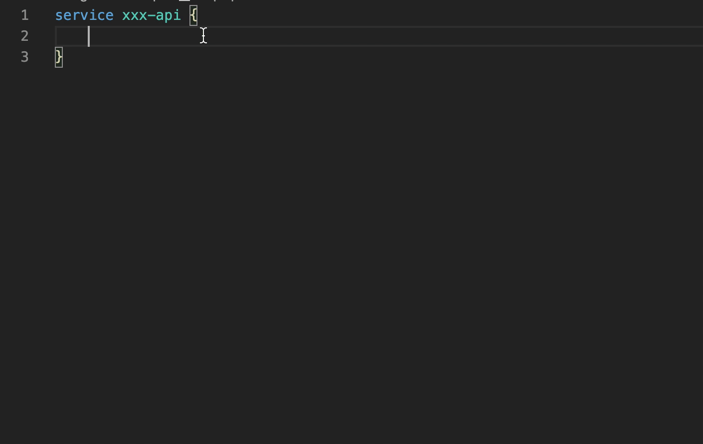

# Goctl for Visual Studio Code

## 功能列表

已实现功能

* 语法高亮
* 跳转到定义/引用
* 代码格式化
* 代码块提示

未实现功能:

* 语法错误检查
* 跨文件代码跳转
* goctl 命令行调用

### 语法高亮

### 代码跳转

### 代码格式化

调用 goctl 命令行格式化工具，使用前请确认 goctl 已加入 `$PATH` 且有可执行权限

### 代码块提示

#### info 代码块

#### type 代码块

#### service 代码块

#### handler 代码块

